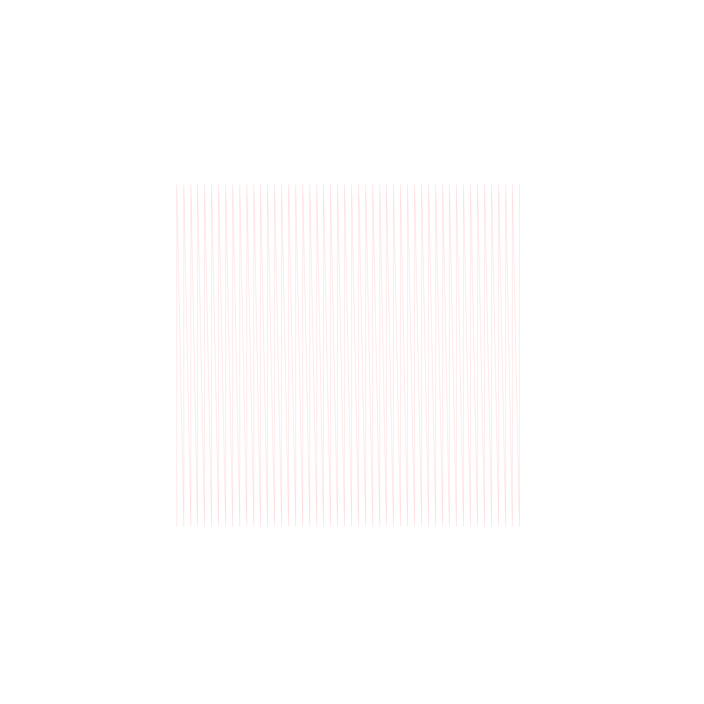

# Axioms - Mathematical Art Generator

Axioms is a project for generating visual art and G-code from mathematical expressions involving complex numbers. It provides an interactive interface to explore different mathematical functions and parameters.

The project is structured into two main crates:

*   `engine`: This crate contains the core logic for parsing mathematical expressions, evaluating them over a complex plane, generating SVG output, and converting SVGs to G-code. It also includes the Bevy application that provides the interactive UI.
*   `interactive`: This crate seems to be an alternative or supplementary interactive environment, possibly for more direct command-line or different UI interactions (further exploration might be needed to confirm its exact role if it's a primary component).

## Features

*   **Complex Mathematical Expression Evaluation**: Axioms can parse and evaluate mathematical expressions involving complex numbers. You can define functions using 'z' as the complex variable and see them rendered.
*   **SVG Generation**: The results of the mathematical evaluations are turned into Scalable Vector Graphics (SVG) files, allowing for high-quality, resolution-independent images.
*   **G-Code Generation**: The application can convert SVG images (either generated or loaded) into G-code suitable for plotters or CNC machines.
*   **Interactive UI**: Built with Bevy and Egui, the application provides a user interface to:
    *   Input and modify mathematical expressions.
    *   Adjust parameters like the viewing area (spec, grid) and step size for generation.
    *   Change colors for the path and background.
    *   Load existing SVG files.
    *   Clear the canvas.
*   **SVG Loading**: Users can load their own SVG files into the application for viewing and G-code conversion.

## Getting Started

### Prerequisites

*   **Rust**: Ensure you have a recent version of Rust installed. You can get it from [rust-lang.org](https://www.rust-lang.org/).
*   **System Dependencies (Linux)**: The project uses Bevy, which has some system dependencies. For Linux users, you might need to install the following:
    ```bash
    sudo apt-get install libxkbcommon-dev libwayland-dev libxkbcommon-x11-dev libvulkan-dev libxcb-render0-dev libxcb-shape0-dev libxcb-xfixes0-dev
    ```
    For other operating systems, please refer to the [Bevy documentation](https://bevyengine.org/learn/book/getting-started/setup/) for any specific requirements.

### Building and Running

1.  **Clone the repository:**
    ```bash
    git clone <repository-url> # Replace <repository-url> with the actual URL
    cd <repository-name>     # Replace <repository-name> with the folder name
    ```

2.  **Run the engine:**
    The main application is within the `engine` crate.
    ```bash
    cargo run --package engine
    ```
    This will build and run the interactive application where you can generate graphics.

*(Note: The `interactive` crate's purpose isn't fully detailed yet. If it's a runnable application with separate instructions, those should be added here too.)*

## Example

The application allows you to generate plots from complex functions. For instance, using an expression like:

`2.2e*(-i*.2*z) + .4z^2`

You can generate intricate patterns. The UI allows you to tweak parameters to explore the visual output.

The repository also contains an example SVG file: `assets/plot_example.svg`. You can load this SVG into the application or use it as a reference for the types of graphics that can be generated and then converted to G-code for plotting.

*(Image of `assets/plot_example.svg` could be embedded here if the hosting platform supports it, e.g., on GitHub)*
```

```

## Contributing

Contributions are welcome! If you have ideas for new features, improvements, or bug fixes, please feel free to:

1.  Fork the repository.
2.  Create a new branch for your changes.
3.  Make your changes and commit them.
4.  Push your branch and open a pull request.

Please ensure your code is well-formatted and, if applicable, add or update tests.

## License

This project does not currently have a specified license. If you are the project owner, please consider adding one. Common open-source licenses include:

*   [MIT License](https://opensource.org/licenses/MIT)
*   [Apache License 2.0](https://opensource.org/licenses/Apache-2.0)
*   [GNU General Public License v3.0](https://www.gnu.org/licenses/gpl-3.0.en.html)

Choosing a license is important as it defines how others can use, modify, and distribute your code.
